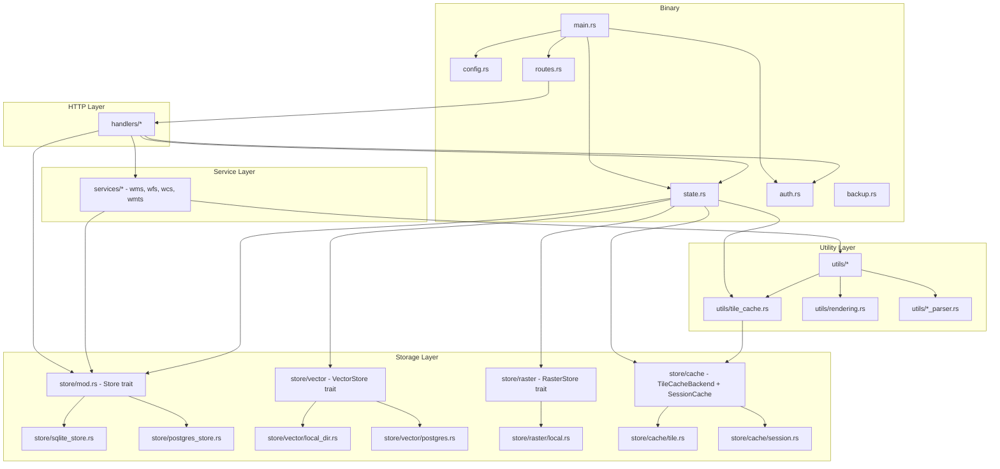
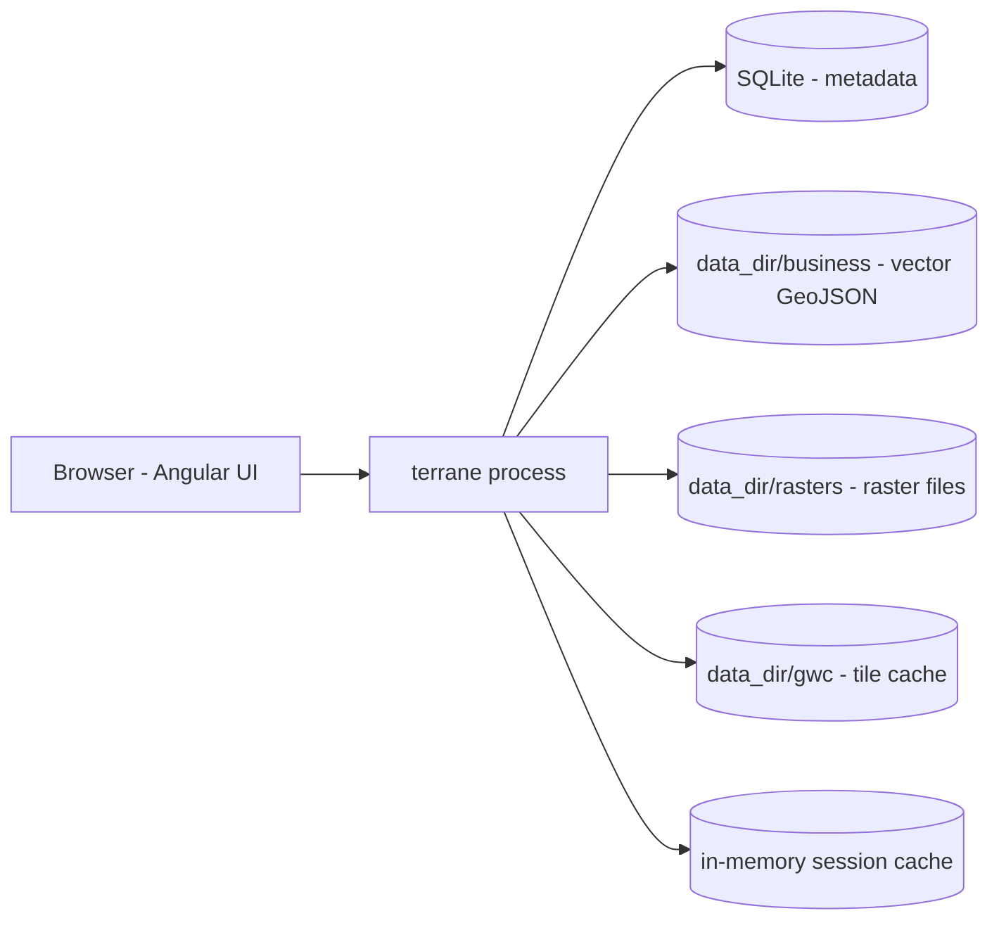
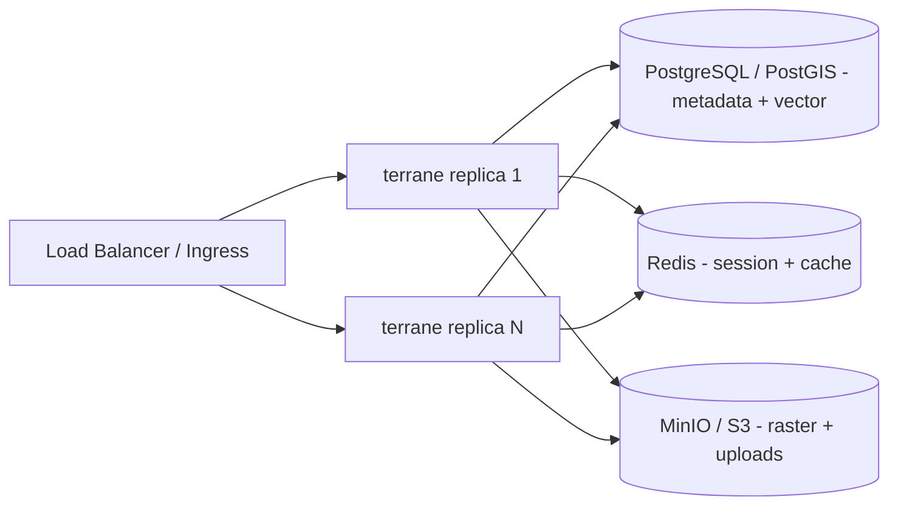
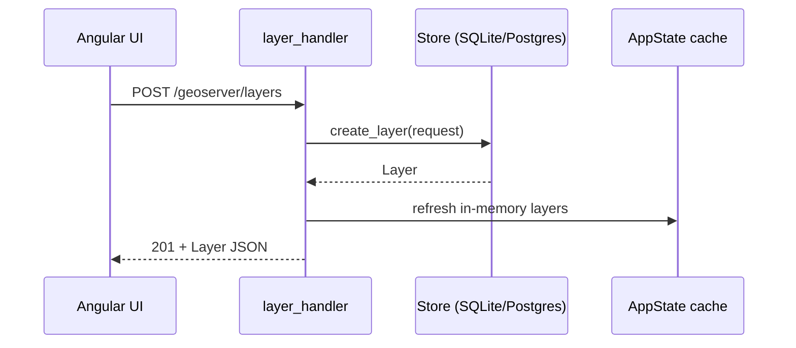
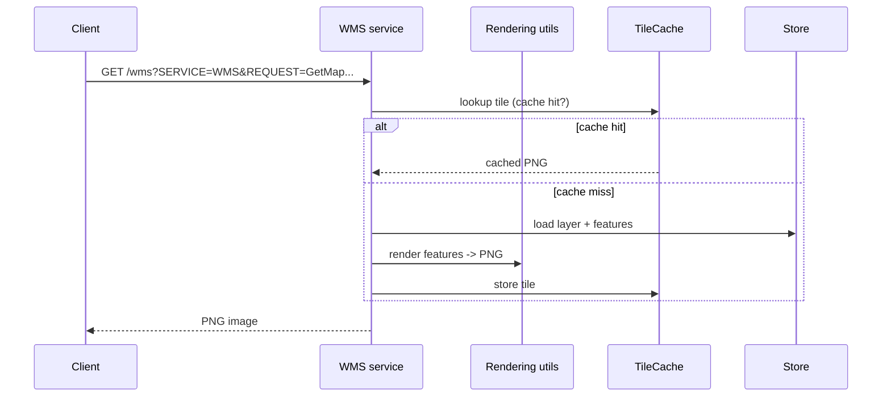
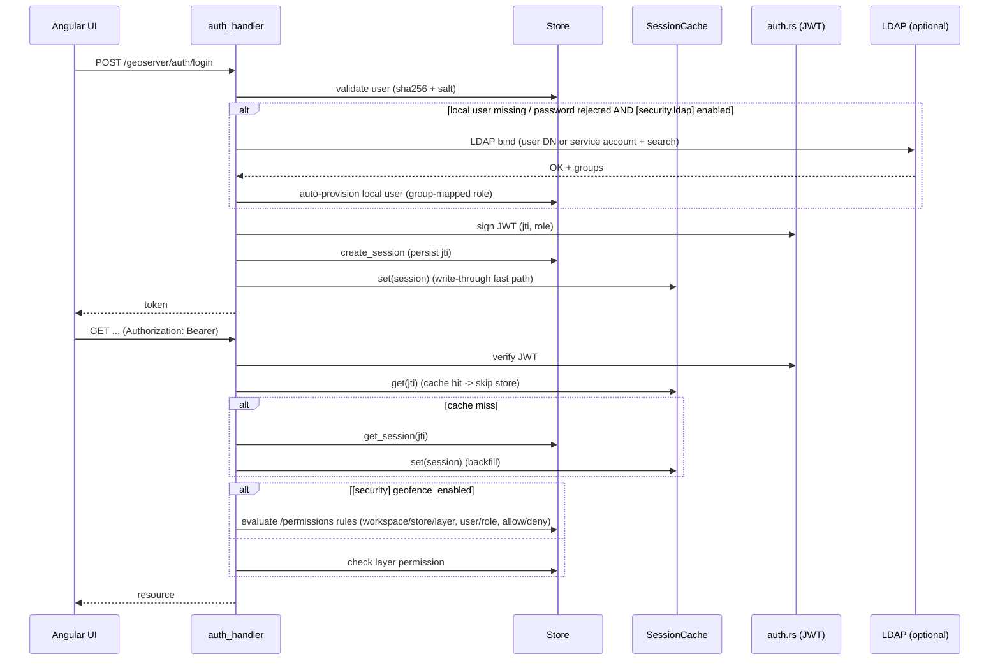
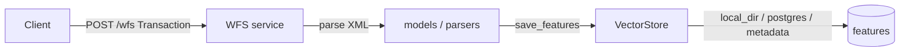

# Terrane — Architecture

> Design rationale, module dependency graph, data flow, and API contract design.
> This document explains **why** the code is structured the way it is.

## 1. Design Goals

1. **Cloud-native** — containerized, 12-Factor configuration, observable, horizontally scalable.
2. **High performance** — Rust + Actix-web async runtime, low-latency OGC responses, tile caching.
3. **Stateless service** — the server is a pure protocol adapter; state lives in external stores.
4. **Dual-mode** — standalone (SQLite + local files + in-memory) and cloud-native (PostgreSQL + Redis + object storage).

## 2. Tech Stack & Selection Rationale

| Layer           | Choice                    | Why                                                                                               |
|-----------------|---------------------------|---------------------------------------------------------------------------------------------------|
| Language        | Rust                      | Memory safety without GC, near-C performance, single static binary, strong typing for geometry/parsers |
| Web framework   | Actix-web                 | High-throughput async HTTP, mature middleware (CORS, multipart), clean route/scope model          |
| Async runtime   | Tokio                     | Industry-standard async runtime (`full` features: signals, timers, filesystem, IO)                |
| Metadata store  | SQLite / PostgreSQL       | SQLite: zero-config standalone; PostgreSQL: HA + PostGIS spatial types for cluster deployments    |
| Data sources    | Per-datasource file backends (local / s3) | File data sources record `file_path` + `file_storage_type` + `s3_*`; PostGIS via deadpool pools; S3 via `S3FileStore` (rust-s3) |
| Cache store     | Local disk (tile) + in-memory (session); layer-level Redis via cache data source | Tile cache on disk with TTL; session fast-path in memory; `Layer.cache_store` → Redis data source backend (shared across replicas) |
| Geometry        | geo / geo-types           | Pure-Rust geometry model and spatial predicates                                                   |
| Raster rendering| image                     | Pure-Rust image encode/decode (PNG/JPEG map output, GeoTIFF read)                                 |
| DB pools        | deadpool-postgres         | Async connection pooling; pools cached per data source in `AppState.pg_pools`                     |
| Frontend        | Angular 22 + Material     | Componentized SPA, RxJS reactive data flow, Material design consistency                            |
| Serialization   | serde / serde_json / quick-xml | Fast JSON + XML (OGC capabilities documents)                                                  |
| Auth            | jsonwebtoken + sha2       | Stateless JWT auth; SHA-256 + salt password hashing                                               |

### Storage model

Terrane is a **data publishing platform**: business data lives in external
stores (PostGIS tables / data files) registered **per data source** in the metadata
store (workspaces, data sources, layer definitions, styles, permissions). The
configuration file only keeps `[metadata]` (SQLite / PostgreSQL); file data sources
record `file_path` + `file_storage_type` (`local` / `s3` / `oss`). `local` stores the
absolute path on the server; `s3` stores an object key and carries `s3_endpoint` /
`s3_region` / `s3_bucket` / `s3_access_key` / `s3_secret_key` (persisted in
`data_sources`). Reads are routed through `service/src/store/file_resolver.rs`: GeoJSON is
streamed from bytes, multi-file formats (Shapefile / WorldImage) and raster readers
(GeoPackage / GeoTIFF / ArcGrid / WCS) materialize the objects to a temp file when they
need a filesystem path. Browse endpoints (`GET /data-sources/browse` + `POST
/data-sources/s3/browse`) power the frontend directory picker. Tile + session cache
stay local by default. This keeps the
"structured data → database, raster → file storage, session/cache → Redis" scaling
vision without a complex multi-section config.

> **Built-in `metadata` data source**: treated as an ordinary data source — besides
> storing catalog metadata it also publishes business data. In `postgres` metadata mode
> it reuses the same PG with PostGIS semantics (`layer.store = "metadata"`, `native_name`
> = table name); in `sqlite` mode it carries no business tables (feature queries return empty).

### Coordinate reference systems & preview

- **Backend reprojection is generic**: WMS raster output + feature queries use PostGIS
  `ST_Transform` (storage CRS → request CRS), and the request `BBOX` is reprojected from
  the request CRS to the storage CRS before spatial filtering. Any EPSG registered in the
  metadata PostGIS (`spatial_ref_sys`) is supported (e.g. EPSG:4326, EPSG:3857, EPSG:4490,
  UTM zones). For file-based data sources and in-process math, `service/src/utils/geometry.rs`
  `transform_coordinates` is backed by `proj4rs` (generic EPSG via `crs-definitions`) with
  a built-in WGS84/Web-Mercator fallback.
- **WMS `BBOX` is always in the request SRS** (standard). The Angular frontend converts the
  layer native bounds to the selected CRS via `frontend/src/app/utils/coords.ts`
  (`transformBounds`) before building a WMS request, so previews stay in range after
  switching CRS. The OpenLayers preview uses the request CRS as the view projection; for
  projections not natively shipped by OpenLayers, the backend reprojects the BBOX to
  EPSG:4326 so the map still renders in the correct location.

## 3. Module Dependency Graph

## 4. Dual-Mode Deployment

### Standalone (default, local dev)

### Cloud-Native (production, stateless replicas)

> **Status**: PostgreSQL metadata / vector backends exist today; local (disk / in-memory)
> raster and cache backends exist too. Redis and object-storage backends are on the roadmap
> — see [ROADMAP.md](ROADMAP.md).

## 5. Data Flow

### 5.1 REST CRUD (e.g. create layer)

### 5.2 WMS GetMap

### 5.3 Authentication & Authorization

**Security building blocks**:

- **Enterprise identity (LDAP)** — `service/src/utils/ldap.rs`: `[security.ldap]`
  (`url` / `base_dn` / optional service `bind_dn`+`bind_password` /
  `user_filter` template / `admin_group` / `default_role`). Login falls back to
  an LDAP bind when the local user is missing or the password is rejected, then
  auto-provisions the local user with the group-mapped role (RFC 4514 DN
  escaping). Enabled via `GEOSERVER__SECURITY__LDAP__*`.
- **Fine-grained GeoFence ACL** — `service/src/utils/geofence.rs`: per-request
  `workspace / store / layer` rules over the `/permissions` model. Most-specific
  rule wins (user > role, layer > store > workspace > global), deny wins
  equal-priority ties, mode hierarchy admin ⊇ write ⊇ read, open default.
  Opt-in via `[security] geofence_enabled`; enforced in WMS GetMap/GetFeatureInfo,
  WFS GetFeature(+WithLock/LockFeature/GetPropertyValue/GetGmlObject), WCS
  GetCoverage and OGC API Maps; admin bypass; 403 on deny.
- **Credential management** — `service/src/utils/secrets.rs`: data-source passwords /
  S3 keys may reference `${ENV_VAR}` (K8s Secrets style); resolved at
  connection-build time (postgres/mysql/mongo/redis/S3) and never persisted or
  logged (`redact` masks values).

### 5.4 WFS Transaction (WFS-T) — planned

WFS-T (Insert / Update / Delete via `POST /wfs Transaction`) is **not implemented
yet** (currently returns 501); it is planned for a later milestone. The intended
data flow once implemented:

## 6. API Contract Design

### 6.1 Base paths

- **OGC services** on the root path: `/wms`, `/wfs`, `/wcs`, `/wmts`
- **REST API** under the configurable context path (default `/geoserver`)
- **Probes & metrics** on the root path, decoupled from the context: `/health/live`, `/health/ready`, `/metrics`

> See [PROTOCOLS.md](PROTOCOLS.md) for the full protocol adaptation matrix (versions,
> operations, output formats, and pending protocols).

### 6.2 REST endpoint groups

All endpoints below live under `/geoserver` (the configurable `api_context`).

| Group         | Endpoints                                                                                          |
|---------------|----------------------------------------------------------------------------------------------------|
| Layers        | `/layers`, `/layers/{name}`, `/layers/{name}/preview`, `/layers/{name}/feature-type`, `/layers/{name}/features[/{id}]`, `/layers/{name}/style` |
| Workspaces    | `/workspaces`, `/workspaces/{name}`                                                                |
| Namespaces    | `/namespaces`, `/namespaces/{prefix}`                                                              |
| Data sources  | `/data-sources`, `/data-sources/test`, `/data-sources/{name}`, `/data-sources/{name}/tables`, `/data-sources/{name}/test` |
| Stores        | `/stores`, `/stores/{name}`, `/workspaces/{ws}/stores`, `/workspaces/{ws}/stores/{name}`           |
| Styles        | `/styles`, `/styles/{name}` (SLD / CSS / YSLD / MBStyle)                                           |
| Layer groups  | `/layer-groups`, `/layer-groups/{name}`                                                            |
| SQL views     | `/sql-views`, `/sql-views/preview`, `/sql-views/{name}`                                            |
| Tiles         | `/tiles/{layer}/{z}/{x}/{y}`, `/tiles/{layer}/{z}/{x}/{y}.pbf`, `/mvt/{layer}/{z}/{x}/{y}`, `/wmts/{layer}/{tileMatrixSet}/{tileMatrix}/{tileCol}/{tileRow}`, `/tiles/cache/clear/{layer}`, `/tiles/cache/stats` |
| Auth          | `/auth/login`, `/auth/logout`, `/auth/verify`, `/auth/change-password`, `/auth/users`, `/auth/users/{username}` |
| Permissions   | `/permissions`, `/permissions/{id}`, `/permissions/check/{type}/{name}`                            |
| Monitoring    | `/server/status`, `/monitor/stats`, `/monitor/requests`, `/monitor/logs`, `/monitor/reset`         |
| Backup        | `/backup/export`, `/backup/import`                                                                 |
| Uploads       | `/data/upload`, `/data/upload/shapefile`, `/data/upload/geotiff`                                   |

### 6.3 Layer ↔ database mapping

- `layer.store` = the data source (store) name
- `layer.native_name` = the database table name
- Boundaries: GET `/layers/{name}` returns `native_bounds.bounds.{minx,miny,maxx,maxy}`; the list endpoint returns `bounds` at the top level.

### 6.4 Error format

Errors are returned as JSON with an HTTP status code; error mapping is centralized in
`service/src/error.rs` and `service/src/store/error.rs`.

### 6.5 Configuration contract

All options are externalized via `service/terrane.toml` + `GEOSERVER__<SECTION>__<KEY>` env
overrides (precedence: CLI > env > file > defaults). See
[DEVELOPMENT.md](DEVELOPMENT.md) for the full variable reference.
